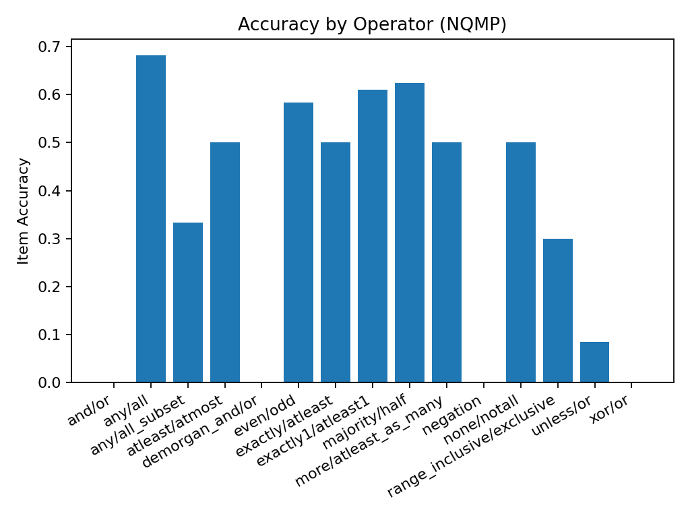

# NQMP Benchmark Report

**Client/Model:** echo / echo  
**Pairs / Seed:** 100 / 42  
**Timestamp:** 20250910_082714

**Item Accuracy:** 0.360  
**Pair Joint Accuracy:** 0.160

## Accuracy by Operator

| operator                  |   item_accuracy |
|:--------------------------|----------------:|
| and/or                    |       0         |
| any/all                   |       0.681818  |
| any/all_subset            |       0.333333  |
| atleast/atmost            |       0.5       |
| demorgan_and/or           |       0         |
| even/odd                  |       0.583333  |
| exactly/atleast           |       0.5       |
| exactly1/atleast1         |       0.611111  |
| majority/half             |       0.625     |
| more/atleast_as_many      |       0.5       |
| negation                  |       0         |
| none/notall               |       0.5       |
| range_inclusive/exclusive |       0.3       |
| unless/or                 |       0.0833333 |
| xor/or                    |       0         |

