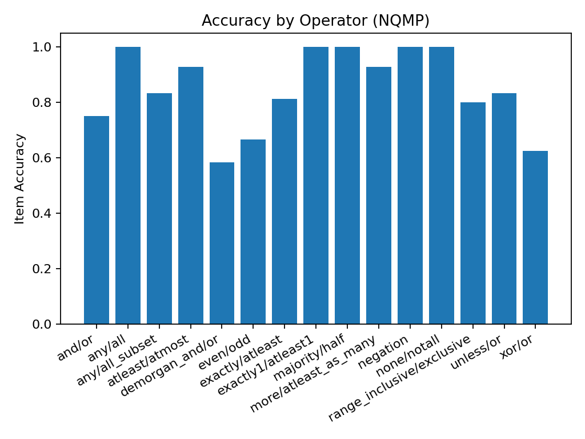

# NQMP Benchmark Report

**Client/Model:** openrouter / google/gemini-2.5-flash  
**Pairs / Seed:** 100 / 42  
**Timestamp:** 20250910_084619

**Item Accuracy:** 0.870  
**Pair Joint Accuracy:** 0.770

## Accuracy by Operator

| operator                  |   item_accuracy |
|:--------------------------|----------------:|
| and/or                    |        0.75     |
| any/all                   |        1        |
| any/all_subset            |        0.833333 |
| atleast/atmost            |        0.928571 |
| demorgan_and/or           |        0.583333 |
| even/odd                  |        0.666667 |
| exactly/atleast           |        0.8125   |
| exactly1/atleast1         |        1        |
| majority/half             |        1        |
| more/atleast_as_many      |        0.928571 |
| negation                  |        1        |
| none/notall               |        1        |
| range_inclusive/exclusive |        0.8      |
| unless/or                 |        0.833333 |
| xor/or                    |        0.625    |

