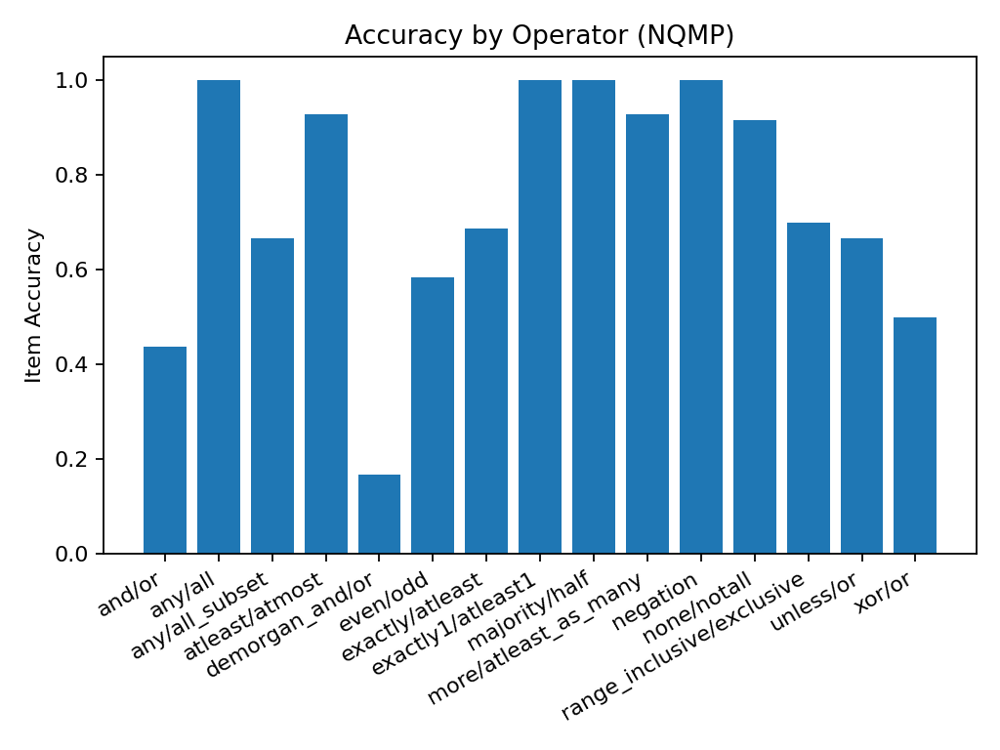

# NQMP Benchmark Report

**Client/Model:** openrouter / openai/gpt-4o-mini  
**Pairs / Seed:** 100 / 42  
**Timestamp:** 20250910_083514

**Item Accuracy:** 0.775  
**Pair Joint Accuracy:** 0.640

## Accuracy by Operator

| operator                  |   item_accuracy |
|:--------------------------|----------------:|
| and/or                    |        0.4375   |
| any/all                   |        1        |
| any/all_subset            |        0.666667 |
| atleast/atmost            |        0.928571 |
| demorgan_and/or           |        0.166667 |
| even/odd                  |        0.583333 |
| exactly/atleast           |        0.6875   |
| exactly1/atleast1         |        1        |
| majority/half             |        1        |
| more/atleast_as_many      |        0.928571 |
| negation                  |        1        |
| none/notall               |        0.916667 |
| range_inclusive/exclusive |        0.7      |
| unless/or                 |        0.666667 |
| xor/or                    |        0.5      |

